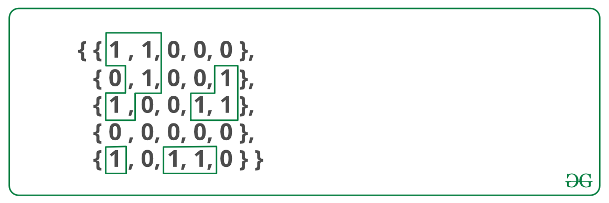

# find number of islands
Given a binary 2D matrix, find the number of islands. A group of connected 1s forms an island. For example, the below matrix contains 5 islands.
Example:
```
input: mat[][] = {{1, 1, 0, 0, 0},
              {0, 1, 0, 0, 1},
              {1, 0, 0, 1, 1},
             {0, 0, 0, 0, 0},
             {1, 0, 1, 1, 0}}
Output: 4
```


`“Counting the number of connected components in an undirected graph”.`
